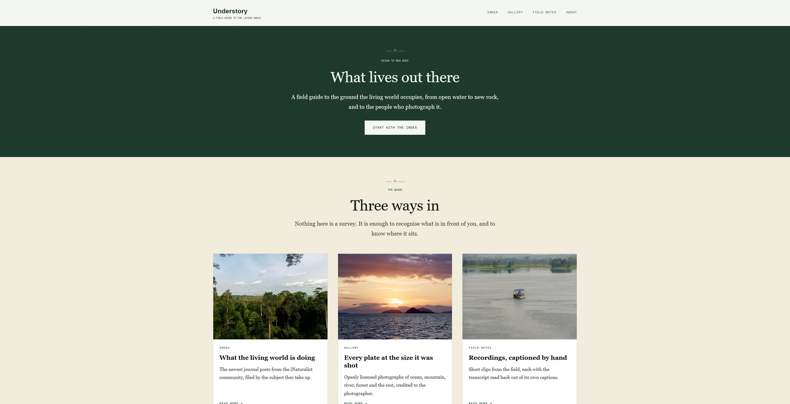
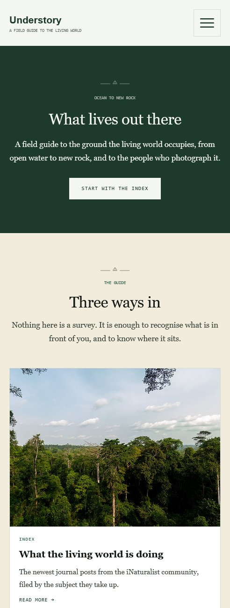
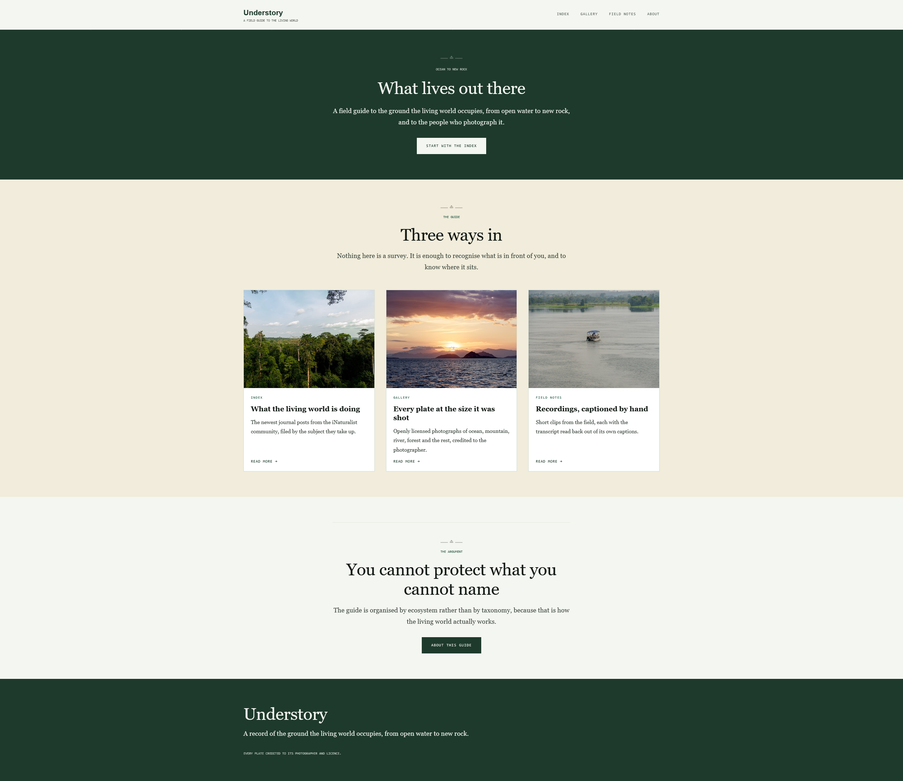
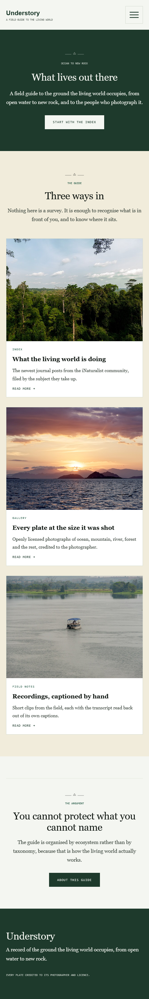

# Understory

A field guide to the ground the living world occupies, from open water to new rock.

**Live site:** https://nature-website-liart.vercel.app/

Built with [Next.js](https://nextjs.org) (App Router), TypeScript, Tailwind CSS v4 and React Aria Components.

---

## Screenshots

| Desktop | Mobile |
| --- | --- |
|  |  |

<details>
<summary><b>Full page, desktop</b></summary>



</details>

<details>
<summary><b>Full page, mobile</b></summary>



</details>

---

## About this project

Understory is a nature field guide that pulls its content from open sources rather than storing it.
The gallery is real photography from Wikimedia Commons, the index is live journal posts from the
iNaturalist community, and the field notes are recordings presented with their captions and a
transcript.

The idea I kept coming back to while building it is that a page should not claim anything it cannot
show. Where a number appears on a screen, it is counted from the data behind it instead of typed
into the copy. Where a picture stands for a recording, it is a frame of that recording. Where a
transcript sits under a video, it is read out of the caption file the video actually uses, so the
two can never disagree.

Everything shown is openly licensed and credited to the photographer who made it.

---

## Features of this project

**Content pulled from open sources**

- **Gallery**: photographs from Wikimedia Commons, filtered across twelve ecosystems (ocean, coast,
  mountains, valley, canyon, river, lake, waterfall, forest, desert, glacier, volcano). Relevance
  comes from the categories Commons reviewers curate rather than from a keyword search, and nothing
  older than three years reaches the page.
- **Index**: the newest journal posts from iNaturalist, filed under topics derived from their
  headlines.
- Every plate links back to its source page and carries the photographer and licence.

**Field notes**

- A page per recording, with a video player, chapters and a transcript.
- The transcript is parsed out of the WebVTT caption file, so it always matches the captions.
- Clicking a line of the transcript seeks the video, and the line under the playhead is highlighted.
- Clip length is read out of the MP4 header rather than stored alongside it.
- The still on the card and the video poster are both frames taken from the recording itself.

**Interface**

- Full-bleed bands alternating cream, green and page ground, on one shared measure.
- Filter components that build their options from the data actually present, so a filter never
  offers a category with nothing behind it.
- Responsive from 375px up, with a sticky masthead and a bento grid for the gallery on desktop.
- Modal navigation on mobile via React Aria Components.

**Engineering**

- Server Components for data fetching, with cached revalidation (1 hour for news, 6 hours for
  photographs) so a page view does not cost a round trip.
- Unit tests with Jest and ts-jest.
- Containerised with a multi-stage Docker build.

---

## What I learned

This project was mostly about practising front-end fundamentals and getting comfortable with
Next.js, and a few things stuck properly:

**Responsive design with CSS Grid.** Building layouts that hold together from a 375px phone up to a
wide desktop, using grid rather than fighting with fixed widths. This is also where I found the
clearest gap in what I know. My grids were responsive, but on wide desktop resolutions I noticed
unusually large gaps between cells whenever there were not enough cards to fill a row, because a
track that has nothing in it still takes up space. Recognising the problem was straightforward.
Knowing the right way to solve it was not, and that is an area of front-end design I still want to
refine.

**Colour tokens and style management.** Early on I was repeating the same Tailwind utility classes
across components, and small differences kept creeping in between places that were meant to match.
Defining colour tokens and prebuilt classes in the CSS file and applying those to my components
instead saved a lot of time, and it meant a change to a colour or a text style happened in one place
rather than in a dozen. It also made styling misalignments much less likely, because two components
using the same class cannot quietly drift apart.

**Routing in Next.js.** How the App Router maps folders to URLs, how nested routes work, and how a
dynamic route like `[slug]` generates a page per record rather than needing one file each.

**State management and prop drilling.** The filter was the thing that taught me this. The filter
buttons and the cards both need the same piece of state, and the fix is not to duplicate it. It is
to make sure both components share a common parent that owns the state and passes it down. Working
that out and restructuring the components around it was the most useful lesson in the project.

**Third-party component libraries.** Using React Aria Components for behaviour I did not want to
build from scratch, such as the drop-down filter on the field notes page and the modal navigation
menu. Learning to read a library's API and fit it into my own styling was a different skill from
writing the component myself.

**Client components and the trade-offs.** When a component needs `"use client"` in order to use
React hooks like `useState`, and more importantly when it does not. Marking a component as a client
component means it ships JavaScript to the browser and cannot fetch data on the server, so the
trade-off is real. What I settled into was keeping pages as server components that fetch the data,
then pushing the interactive parts down into small client components underneath them. That pattern
shows up across the index, gallery and field notes pages.

---

## What AI helped with & what I did myself

I want to be straightforward about this, because the split is genuinely uneven and I learned
different things from each half.

### What I built myself

The foundation of the application is mine, and most of what the AI worked on later was layered on
top of decisions I had already made:

- Project setup, the root layout, and the responsive typography scale using `clamp()`.
- The colour token system in `globals.css`, including the palette, the plate grounds and the status
  colours. Every colour the AI used later came from tokens I had already defined.
- The card component and the `data.js` file behind it.
- The filter architecture. Working out that `filter.tsx` needed to share state with `card.tsx`, and
  restructuring so props are passed down from each page, was mine and took several passes.
- The routing structure and the `pages` directory.
- The gallery component and its layout, including making the grids responsive.
- React Aria Components for the modal navigation, the routes array, and the active-route state.
- Empty states, alignment fixes, mobile responsiveness, the horizontal scrollbar styling.
- Installing Jest and writing the first tests.
- The starting point for the field notes and about routes, and the video and caption files.

### What AI helped with

I used Claude for the parts where I wanted to move faster than I could research:

- Integrating the iNaturalist and Wikimedia Commons APIs, including working out which endpoints
  actually carried what I needed. Openverse was tried first and abandoned once it turned out it has
  no date filter at all.
- The WebVTT parser and the MP4 duration parser.
- The visual overhaul onto a reference design, and the band system it uses.
- The bento arrangement the gallery uses on desktop, and the fix for the grid gaps I had run into.
- Building out the about page and the field notes detail route.
- The Docker setup.

### What I took away from it

The most useful thing was not the code. It was watching problems get diagnosed rather than guessed
at. A 404 that turned out to be a corrupted Next.js type cache rather than a routing mistake. A
video poster that came out black because the clip fades in from nothing. An image transfer that got
thrown away because the bytes did not decode cleanly.

The honest downside is that the codebase moved faster than my understanding of it in places. I can
read all of it, but there are files I did not write line by line, and that is a real difference.

---

## What I plan to do going forward

I want to scale down the size of my next project.

Rather than building something this broad again, I plan to work on something smaller, a user
authentication system, and use it to learn about the different authentication methods properly:
sessions, tokens, OAuth, and where each one is the right choice.

The reason is control. On a smaller project I will maintain more knowledge over the infrastructure I
am building, and debugging a codebase I managed mostly myself will be far easier than debugging one
that grew faster than I did. I would rather understand a small system completely than a large one
partially.

---

## Running it locally

```bash
npm install
```

```bash
npm run dev
```

Then open http://localhost:3000.

### Tests

```bash
npm test
```

### Docker

```bash
docker build -t understory .
```

```bash
docker run -p 3000:3000 understory
```

The build prerenders the pages, which means it reaches iNaturalist and Wikimedia over the network.
Without outbound access the build still succeeds, but the gallery and index come out empty.
